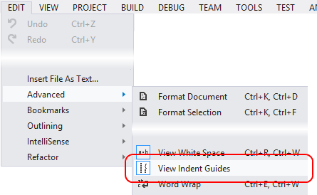
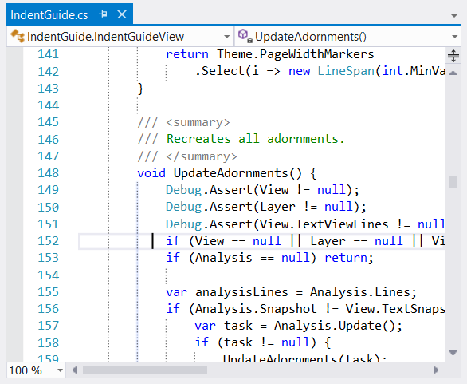
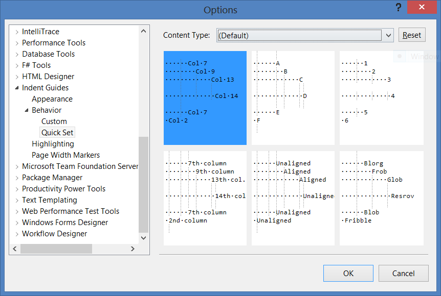

## Install

The latest release [in the gallery](http://visualstudiogallery.msdn.microsoft.com/e792686d-542b-474a-8c55-630980e72c30) supports Visual Studio 2017, Visual Studio 2015 and Visual Studio 2013.

Note that the Extension dialog within Visual Studio 2017 will not find it, and you will need to go to the gallery page directly. (This is because it's way too hard to build an extension that works with previous versions of Visual Studio and also fully conforms to the arbitrary rules needed to be installable via the IDE. When I decide to drop support for VS 2015 and earlier then it will appear in search results in the IDE.)

## Still using Visual Studio 2010-2012?

The last release for VS 2010 through VS 2012 is [Indent Guides v14](https://indentguide.codeplex.com/releases/view/110312).

## No guides after upgrading?

Ensure this menu is checked:

(There is a bug where Visual Studio will reset some settings on upgrade.)

# Indent Guides for Visual Studio

See [Indent Guides](http://visualstudiogallery.msdn.microsoft.com/e792686d-542b-474a-8c55-630980e72c30) in the Visual Studio Gallery for the latest stable release and end-user QA.

The screenshots are from Indent Guides v13.

